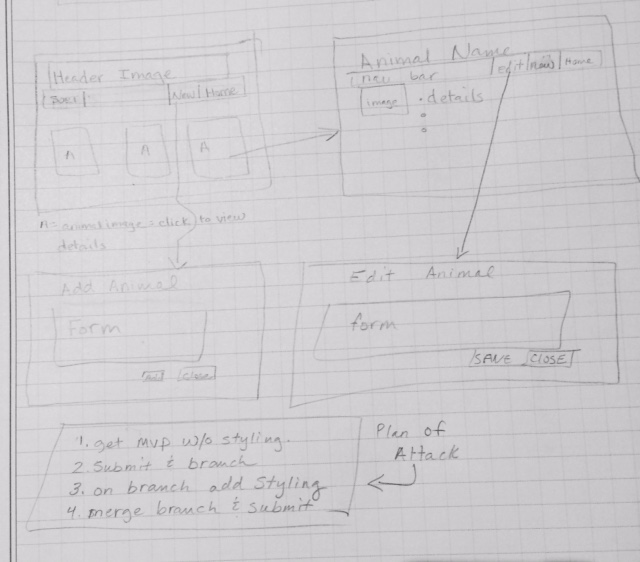

# A Wilder Vision
 

## Short Description
> Epicodus Javascript Independent Project for Week 3 using Angular, JavaScript, Gulp, NPM, Bootstrap, CSS, and HTML.

## Table of Contents
- [Sections](#sections)
  - [Install](#install)
  - [Usage](#usage)
    - [Demo](#demo)
    - [Building](#building)
  - [Known Bugs](#known-bugs)
  - [Planning](#planning)
  - [Maintainer](#maintainer)
  - [Contribute](#contribute)
  - [License](#license)

***

## Install
**All installation instructions are for macOS**

You first will need the following things properly installed on your computer.
 * [Git](https://git-scm.com/)
 * [Node.js](https://nodejs.org/) (with NPM)
 * [Bower](https://bower.io/)

With the above items installed you may now do the following in your terminal:
 * `git clone https://github.com/gstuart/A-Wilder-Vision.git`
 * `cd a-wilder-vision` :file_folder:
 * `npm install`, enjoy :coffee:, :beer:,  or :smoking: while waiting
 * `bower install`

## Usage
* `gulp serve`
* :eyes: app at [http://localhost:4200](http://localhost:4200) :tada:

### Building
 * `gulp build` (development)

### Demo
**Adding and Editing an Animal:**

## Known Bugs
> No known :bug:, :beetle:, or :ant:.

## Planning
1. Configuration/dependencies
  * Angular - framework that is used to create and deploy application.
  * Bootstrap - styling and containment throughout application.

2. Integration
  * app.component for navigation and page header.
  * app.module for capturing modules and dependencies.
  * animal.module for all components related to the animal.  
  * index page for homepage which contains a list of all questions.
  * animal-list.component for all things animals.
  * new-animal.component for creating a new animal object.
  * edit-animal for editing an existing animals.

     

3. UX/UI

## Maintainer
[Grace Stuart](href="https://github.com/gstuart")

## Contribute
* Questions may be submitted to gstuart.:octocat:@gmail.com.
* Pull requests accepted.
* NOTE: If editing the Readme, please conform to the [standard-readme specification](https://github.com/RichardLitt/standard-readme/blob/master/spec.md).

## License
**GLP License :copyright: 2017 _Grace Stuart_**

***

**[:top:](#a-wilder-vision)**
